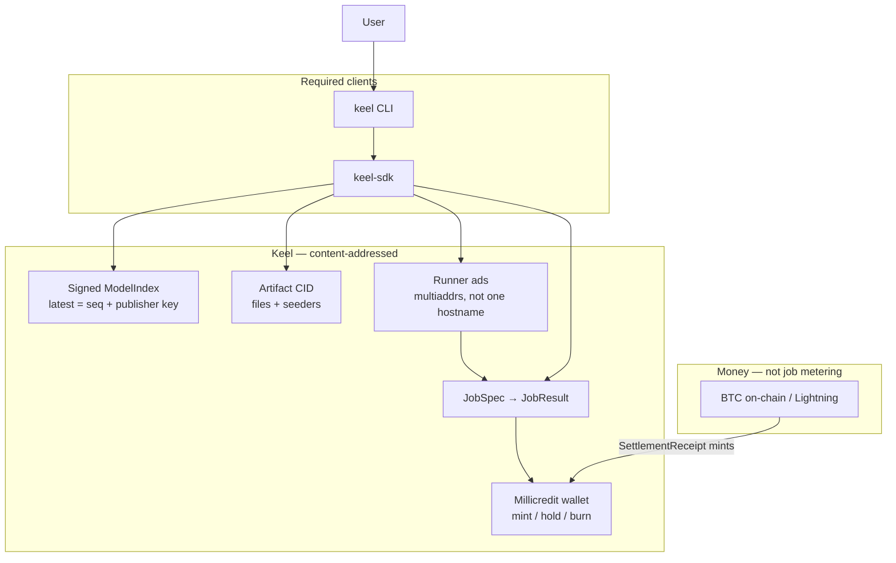
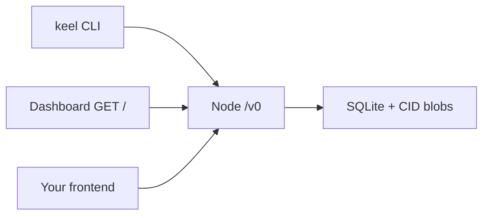

# Keel

**Keel** is an open protocol for sharing, finding, running, and paying for model work after any one company, computer room, named address, shop, or payment company is forced to stop.

The name is the point: a keel is the member that remains if the superstructure is ripped off. Hosted products are vessels. They can be sunk. This repo is the structure underneath.

Identity of an artifact or job is a **hash of canonical bytes**. Names, URLs, tenants, and “latest” pointers are comments.

## Architecture

Hashes are identity. Hosted UIs are caches. Money (sats) mints millicredits; jobs hold and burn millicredits — those are different ledgers.



## Operate it

The **node** is the product. CLI, dashboard, and anyone else’s UI are HTTP clients of `/v0`. If a fact is not on that API, it is not an operator fact.



```bash
cargo test                          # types + API-without-dashboard + CLI=API
cargo run -p keel-cli -- node serve --data-dir /tmp/keel-demo --visibility public
# http://127.0.0.1:7420/     operator dashboard (optional)
# http://127.0.0.1:7420/v0  route catalog for BYO frontends
# default --visibility invite  (not listed on GET /v0/peers)
```

How a lab offers a model, and how a known CID finds independent hosts: [`docs/publish.md`](docs/publish.md). Kill-list and mock-vs-real: [`docs/PROOF.md`](docs/PROOF.md).

## What this is (v0)

| Layer | v0 |
|---|---|
| Artifacts | SHA-256 files + `ArtifactManifest` |
| Discovery | Signed `ModelIndex` (seq + publisher key), HTTP mirrors |
| Inference | `JobSpec` / `JobResult`, runner ads, client-local routing |
| Settlement | BTC / Lightning money; **millicredit** inventory (mint / hold / burn) |
| Identity | Ed25519 keys; no KYC in protocol |
| Governance | Opt-in `FilterList`; no kill switch |
| Clients | `keel` CLI **and** `keel-sdk` (both required) |

## Workspace

```
crates/keel-types   documents, IDs, credit + job state machines
crates/keel-runner  CID-addressed tiny weights (CI) and llama.cpp (ops)
crates/keel-node    blobs + millicredits + jobs + `/v0` HTTP + dashboard
crates/keel-sdk     HTTP client (CLI and BYO frontends)
crates/keel-cli     operator CLI (a client of `/v0`)
SPEC.md             protocol
docs/publish.md     offer a model; find hosts for a CID
docs/PROOF.md       how we prove it works
sql/schema.sql      v0 node persistence
```

```bash
cargo test
cargo run -p keel-cli -- node serve --data-dir /tmp/keel-demo
# dashboard: http://127.0.0.1:7420/   API catalog: /v0
```

See [`docs/PROOF.md`](docs/PROOF.md). The proof that matters: two nodes fetch a CID; Lightning mints millicredits on a `payment_hash`; a runner loads those bytes; `keel status` returns the same JSON as `GET /v0/status`; the dashboard was never required.

## Invariant

If a hostname dies, the hash still fetches from whoever still has the bytes. A job that was specified as `JobSpec` can still be submitted by this CLI to any remaining runner.

## Honest non-claim

Keel does not claim resistance to a state that can coerce operators, seize machines, or eclipse every remaining peer. It is designed against corporate ToS, single-cloud/CDN takedown, card-rail censorship, DNS seizure, and removal of one client from an app store.

## License

MIT.
