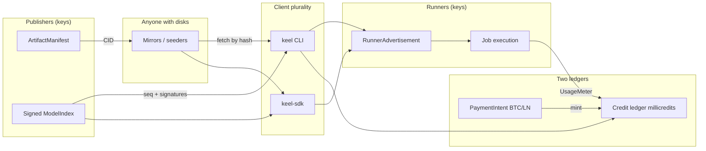

# Keel protocol specification

**Status:** v0 draft. Recommendations are labeled. Speculation is labeled. No fake standards.

**Working title retired:** “OAS / Open Artifact Substrate.” The protocol and this repo are **Keel**.

---

## Problem

People who want to share, find, run, and pay for model work must still be able to do so after any one organization, computer room, named address, shop, or payment company is forced to stop — and pressure should increase independent copies and workers, not shrink them.

---

## 0. Invariant

**Invariant.** Bytes that matter are content-addressed. Control planes that matter are signed documents with sequence numbers. Anything with a hostname, a tenant UUID, or a “latest” URL is a cache.

**Consequence.** Takedown of a company, CDN, or DNS name cannot change what a content id *is*. It can only change *who still has a copy*. Survival is a replication problem, not an account problem.

**Application.** A model is a Merkle list of file hashes. A job is a hash of a `JobSpec`. Payment of compute is a hold/burn on a credit ledger keyed by that job hash. Money arrival is a separate `SettlementReceipt` on a chain.

**Reuse.** Treat every “source of truth” that is a row in someone else’s database as a cache of a hash-linked document.

Wire documents use JSON in v0 (RFC 8785 canonical form when hashed). **v1 recommendation:** DAG-CBOR for hashed documents. Do not use non-canonical `serde_json::to_vec` as identity.

---

## 1. Threat model

| Threat | What the design assumes | Stronger under attack means |
|---|---|---|
| Corporate ToS / account bans | Publishers and runners are keys, not accounts | Banned party re-announces from a new multiaddr; CID unchanged |
| Single cloud / CDN takedown | Blobs have many seeders; no required origin | Scarcity ads → more seeders for that CID |
| Payment-rail censorship (cards/Stripe) | Antifragile path is BTC + Lightning | Existing millicredits still burn; new mints via LN |
| DNS / domain seizure | Bootstrap is keys + multiaddrs + bundled seeds | Clients ignore DNS; signed indexes still work |
| App-store removal of one client | Protocol requires ≥2 clients (CLI + library) | Users compile; second UI appears |

**In-scope adversaries:** cloud operators, app stores, payment processors, domain registrars, a company that used to host “the” index.

**Honest non-goals (do not claim):**

- Full nation-state adversary with physical coercion, customs seizure of GPUs, or compelled key disclosure.
- Global passive traffic analysis of every ISP hop (Tor/I2P are optional transports, not v0 requirements).
- Forcing any operator to store or run bytes they refuse (or that their jurisdiction forbids).
- Confidential prompts/results against the runner who executes them.
- A consensus opcode that deletes a model from the network.

---

## 2. Architecture



**Trust boundaries**

| Boundary | Trusted for | Not trusted for |
|---|---|---|
| Local client | Hash checks, signature checks, policy (filter lists) | Remote honesty |
| Publisher key | Index entries they signed | Other publishers’ aliases |
| Mirror | Serving bytes | Correctness (client re-hashes) |
| Runner | Execution they advertised | Unheld jobs; undeclared models |
| Settlement rail | External money movement | Job metering |
| Any hosted UI | Convenience | Being the network |

---

## 3. Layers

### 3.1 Artifacts

An **artifact** is an immutable bundle: weights, tokenizer, config, optional dataset shard list.

- Each file: `cid = sha256(file_bytes)`, encoded `sha256:<hex>`.
- `ArtifactManifest` is hashed **without** `signatures`. `artifact_cid = sha256(rfc8785(manifest_minus_signatures))`.
- Signatures are over `artifact_cid`, so they can be added later without changing identity.
- Replication: HTTP(S) URL, BitTorrent magnet, later Bitswap. The protocol object is `SeederRecord`, not “the CDN.”

**Recommendation:** v0 hex `sha256:<hex>`. Map to CIDv1 (`raw` + sha2-256) in v1 for IPFS interop. Do not require a running IPFS daemon in v0.

**Speculation:** paying seeders on takedown — v2.

### 3.2 Discovery

Clients must find the *right hash* without one website.

- **Signed `ModelIndex`:** `{seq, prev, entries: [{alias, artifact_cid}]}`. “Latest” = highest `seq` from a **key you chose**, not a URL.
- **Bootstrap (v0):** `--bootstrap` / `KEEL_BOOTSTRAP` (raw `http://ip:port`, not a required domain), plus a signed **peer advertisement**.
- **Visibility (v0):** `public` nodes gossip `peer.announce` on `GET /v0/peers`. `invite` nodes are absent from that list; a signed `peer.invite` capability is the only way to learn their multiaddr. Tampering the invite fails verify.
- **Gossip (v1):** flood `IndexHead {publisher, seq, index_cid}` and `SeederRecord` (peer ads are the v0 subset).
- **DHT (v1):** `CID → provider multiaddrs`.

v0 `GET /v0/seeders/{cid}` lists hosts **that node has been told about**. After `POST /v0/peers/sync`, a public node can also try known peer `/v0/blobs/{cid}` without a copied seeder row. Invite-only nodes never appear on the public list. Operator walkthrough: [`docs/publish.md`](docs/publish.md).

**Recommendation:** git repos, nostr events, and static mirrors are *transports for signed indexes*, not identity.

### 3.3 Inference

- Client builds `JobSpec` (model CID, input refs, `max_millicredits`, payer key, nonce).
- `job_id = sha256(rfc8785(JobSpec))`.
- Runners publish `RunnerAdvertisement` (caps, price, multiaddrs, expiry, signature).
- Routing is **client-local**: filter ads → pick N → `job.submit` to their multiaddrs.
- Result is `JobResult` plus `UsageMeter`.

No single API hostname is required.

### 3.4 Settlement — two ledgers

| | **Credit ledger** | **Money ledger** |
|---|---|---|
| Unit | millicredit | sat / later XMR atomic unit |
| Meaning | prepaid *right to consume work* | external value transfer |
| Ops | mint, hold, release, burn, expire | intent, confirm, fail |
| Idempotency | `account \|\| job_id \|\| kind` | rail txid / payment hash |
| Refund | release unused hold; cash-out is *not* in-protocol | invoice expiry / chain reorg |

**Recommendation:** `millicredit` (`i64`) is the unit of account. 1 credit = 1000 millicredits. Runners quote millicredits per 1k billable tokens **or** per second (job class chooses one primary meter). Token counts are evidence inside `UsageMeter`, not the account unit.

**Why not raw tokens as money:** tokenizers differ; a “token” is not a conserved quantity across models.

**Why not sats on the job:** mixes FX and metering; holds break across fee spikes; a second rail (XMR) could not quote.

BTC/LN in v0. XMR as a `SettlementRail` impl in v1/v2 (same `PaymentIntent` envelope).

v0 credit ledgers are **custodial per wallet implementation** (your node, or a hosted UI as a custodian you can walk away from). A global credit chain is speculation.

### 3.5 Identity and reputation (minimal)

- Identity = Ed25519 pubkey (32 bytes, hex on the wire).
- Attestations: “this key published artifact_cid”; “this runner ran job_id.”
- **No KYC in the protocol.** Hosted KYC is a product policy on *its* accounts, not on keys.
- Stake/reputation: **speculation / v2**. v0 may keep local counters (`jobs_ok`, `hold_timeouts`) as a client heuristic, not consensus.

### 3.6 Governance

| On-wire | Social consensus |
|---|---|
| Document schemas, hash function, signature scheme | Which publisher keys you bootstrap |
| Job/credit state machines | Which filter lists to honor |
| Credit conservation per local ledger | Whether millicredits should cash out |
| — | Client software upgrades |

**Banned-model lists:** `FilterList` is a signed document `{seq, deny_cids[], deny_aliases[]}`. Clients *may* subscribe. Runners *may* refuse. There is no flood-fill delete. An app-store build can ship a default list; this CLI defaults to empty.

### 3.7 Client diversity

v0 **must** ship:

1. `keel` CLI (fetch, seed, submit, pay).
2. `keel-sdk` library (the CLI is a consumer of the library, not a second copy of the protocol).

Call the network “live” only when a job completes with any one hosted UI down, using the CLI talking to a non-hosted runner.

---

## 4. Wire sketch

Every signed message:

```json
{
  "keel": 0,
  "kind": "artifact.announce",
  "body": {},
  "from": "<hex ed25519 pubkey>",
  "ts": 1778260000,
  "sig": "<hex 64-byte sig>"
}
```

`sig` = Ed25519 over `sha256(rfc8785({keel, kind, body, from, ts}))`.

| kind | body |
|---|---|
| `artifact.announce` | `ArtifactManifest` |
| `artifact.want` | `{ "cid": "sha256:…" }` |
| `seeder.announce` | `SeederRecord` |
| `index.publish` | `ModelIndex` |
| `runner.announce` | `RunnerAdvertisement` |
| `job.submit` | `{ "job_spec": …, "hold": … }` |
| `job.accept` | `{ "job_id", "quote_millicredits", "expiry" }` |
| `job.result` | `JobResult` |
| `credit.hold` / `credit.burn` / `credit.release` | `CreditMovement` |
| `pay.intent` | `PaymentIntent` |
| `pay.receipt` | `SettlementReceipt` |

---

## 5. Metering

**Hold (async):**

1. Client sets `max_millicredits` on `JobSpec`.
2. Runner `job.accept` quotes `q` where `q ≤ max`. Wallet creates `hold(q)` with `idempotency_key = "hold:" + job_id`.
3. On success: `burn(min(metered, q))` then `release(q - burned)`. On fail/timeout: `release(q)`.
4. Hold expiry (recommendation: 15 min default) → `expire` (release with a distinct kind for audit).

**Idempotency keys:** `hold:{job_id}`, `burn:{job_id}`, `release:{job_id}`, `mint:{rail}:{rail_ref}`.

Replays no-op. Double-burn is a protocol error.

**Invariant:** `balance >= 0`, `held >= 0`. `mint` increases balance; `hold` moves balance → held; `burn` destroys held; `release`/`expire` move held → balance.

Streaming LN HTLCs per chunk is **speculation / v2**. v0 is prepaid hold.

---

## 6. Roadmap

| | Smallest useful network | Not yet |
|---|---|---|
| **v0** | Pin and fetch a GGUF by CID from ≥2 HTTP mirrors; signed index; CLI + lib; LN invoice mints millicredits; one runner type (e.g. llama.cpp); hold/burn; signed **public vs invite** peer ads | DHT, private prompts, training, stake |
| **v1** | Provider DHT; onion multiaddrs; second-language client; gossip ads; XMR rail behind the same trait | TEE/FHE, credit FX market |
| **v2** | Seeder incentives; optional private job channel; reputation/stake; dataset packs | “Uncensorable against coercion” |

---

## 7. Security and abuse

| Abuse | In-protocol | App-layer |
|---|---|---|
| Index spam | Signatures; expire; optional dust on announce (v1) | Publisher allowlists |
| Unpaid jobs | No execute without `HoldActive` unless runner opts into `free` | Hosted “free tier” is its own money |
| Malicious weights | Hash pin; never execute an alias without resolving CID | Sandbox, community attestations |
| Prompt/result privacy | **Not provided** | Encrypt to runner key; or local inference |
| Result substitution | `JobResult` signed by runner key; client may re-run | Sampling checks |
| Ledger inflation | Credits are local/custody, not a global chain in v0 | Don’t treat millicredits as a currency with implicit FX |

---

## 8. Explicit non-goals for v0

- Kubernetes, one Postgres, or any product platform as network source of truth
- Training marketplace or “upload a dataset and we train”
- Mandatory namespacing, likes, or a single website as discovery
- Stripe, Apple Pay, or any card rail as a required mint path
- Mandatory DHT, IPFS, or Tor
- Global consensus on millicredit balances
- KYC, content-ID copyright enforcement, or a foundation kill switch
- Claiming nation-state resistance

---

## 9. Persistence (v0 node)

On disk: `~/.keel/blobs/sha256/<hh>/<hex>` plus SQLite `~/.keel/node.sqlite`. See [`sql/schema.sql`](sql/schema.sql). Tables are indexes of hash-linked documents, not identity. New version = new hash.

---

## 10. Open questions (protocol)

1. Genesis publisher keys in the CLI seed list (recommendation: empty extras file + operator-supplied keys; never a single key).
2. Millicredit peg: lock millicredits per sat at invoice time (recommended) vs floating FX per job.
3. Allow runner `price = 0` in v0, or require dust holds?
4. Datasets in v0 manifests vs defer (copyright/size).
5. Custodial millicredits with export-to-CLI vs pretending credits are a global chain on day one.
