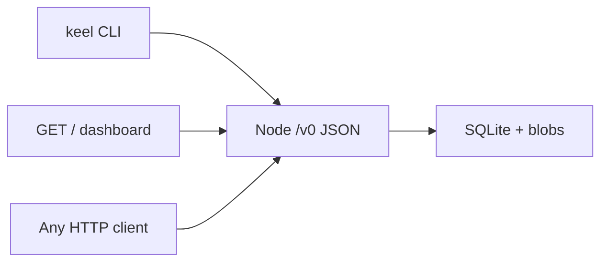

# How to prove Keel works

The question is not “does the dashboard look right?” The question is: **share, find, run, and pay still happen when any one face of the system is gone.**

## Invariant

CLI, operator HTML, and a stranger’s frontend are **clients**. The node HTTP API under `/v0` is the operator surface. If a number exists only in HTML, it is not real.



## What we actually test

| Layer | What it proves | Command |
|---|---|---|
| Types | Credit conservation; job status cannot skip hold; envelope tamper fails | `cargo test -p keel-types` |
| Runner | Flip one weight byte → different `JobResult`; prefix `cid-weights:` | `cargo test -p keel-runner` |
| Node API | Blob CID roundtrip; mint idempotency; job hold/burn; **dashboard never fetched** | `cargo test -p keel-node --test proof_api` |
| Two nodes | Put on A, seeder, get CID on B (not one SQLite) | `proof_two_nodes_fetch_cid` |
| CLI = API | `keel status` JSON equals `GET /v0/status`; CLI mint visible on HTTP | `cargo test -p keel-cli --test cli_proof` |
| Completeness | Two binds, signed index, LN `payment_hash` mint, CID runner, no `GET /` | `cargo test -p keel-cli --test completeness` |
| Dashboard is a client | HTML contains `/v0/status`; CORS allows another origin | `proof_dashboard_is_only_a_client` |

The labeled mock (`keel-mock:`) remains only when the model bytes are not `KEELW001`. Completeness **must not** use it, and **must not** mint with `rail: mock`.

## Completeness kill list

`proof_v0_completeness` (must pass on `cargo test`):

1. Node A: identity, put `fixtures/keelw001.bin`, `ArtifactManifest`, signed `ModelIndex`.
2. Node B: resolve head index, fetch model CID from A’s seeder, pay a real BOLT11 (in-process LDK), millicredits mint on `payment_hash` (`mint:btc_lightning:…`).
3. Submit `JobSpec` (model = that CID), hold, run via `CidWeightsRunner`, burn/release. Output starts with `cid-weights:`.
4. `keel --api B status` JSON matches `GET B/v0/status`.
5. Never `GET /` on A. Blob still on B.

Lightning in CI is in-process (`lightning-invoice` BOLT11 + preimage settle). Operators may set `KEEL_LND_REST` + `KEEL_LND_MACAROON` for LND REST; same JSON. Llama.cpp is `KEEL_LLAMA_CLI` behind the same `InferenceRunner` trait.

## Manual proof (operator)

Terminal 1:

```bash
cargo run -p keel-cli -- node serve --data-dir /tmp/keel-demo
```

Dashboard: [http://127.0.0.1:7420/](http://127.0.0.1:7420/) — optional.

Terminal 2 (CLI, same API):

```bash
export KEEL_API=http://127.0.0.1:7420
cargo run -p keel-cli -- identity show --data-dir /tmp/keel-demo
cargo run -p keel-cli -- account new          # copy account hex
cargo run -p keel-cli -- pay intent $ACCT 10000 --sats 1
# settle with preimage (CI does this; LND settles via the channel)
cargo run -p keel-cli -- blob put README.md
cargo run -p keel-cli -- status
```

Bring-your-own frontend (curl is a frontend):

```bash
curl -s $KEEL_API/v0 | jq
curl -s $KEEL_API/v0/status
```

**Kill the dashboard tab.** Repeat `keel status`. If that fails, the CLI was a lie.

## What this does *not* prove yet

- Multi-hop Lightning against a live network (CI uses in-process invoices)
- GPU / llama.cpp quality (set `KEEL_LLAMA_CLI` for the operator runner)
- DHT, gossip, onion, XMR, or a global credit chain

Those stay behind the same `/v0` shapes.

## API catalog

`GET /v0` returns the route list. That document is the contract for other UIs. Adding a private dashboard-only endpoint is a spec violation.
