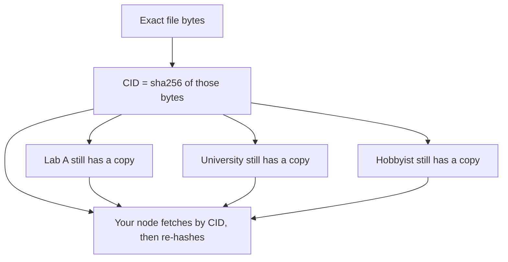
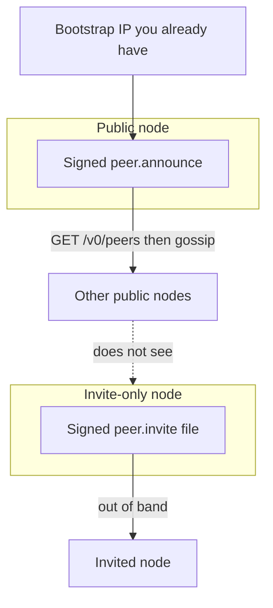
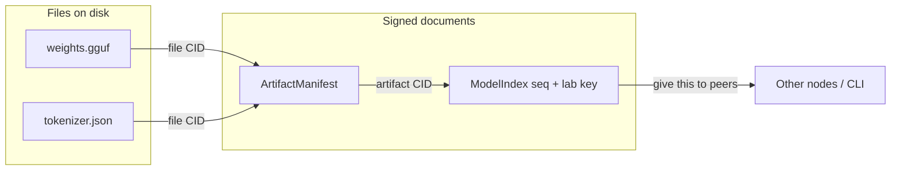
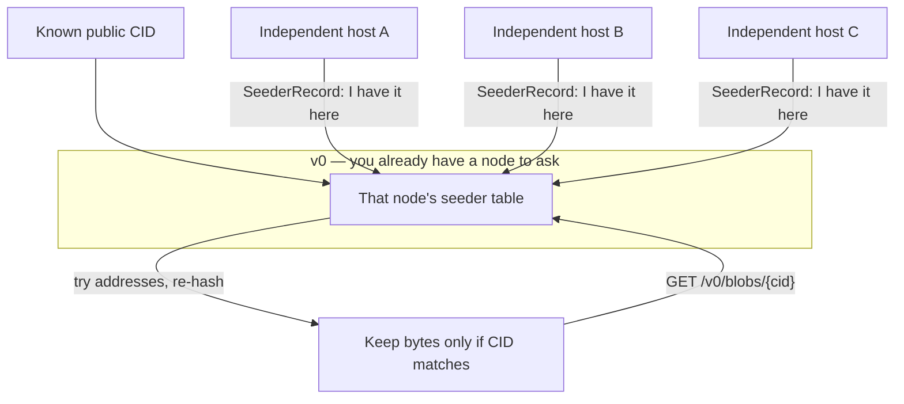
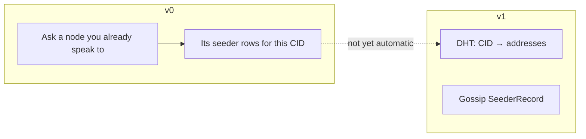
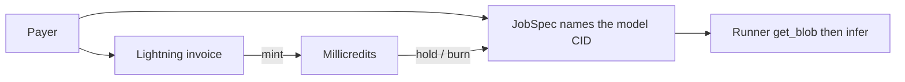

# Offer a model, find a host

The question is not “where do we list this on a website?” The question is: **same bytes → same hash → whoever still has a copy can serve it.**

## Invariant

A model’s identity is the SHA-256 of the file bytes (`sha256:<hex>`). A hostname is a cache. “Latest” is the highest `seq` on a **publisher key you chose**, not a URL.

**Consequence.** An independent lab does not register with Keel. They put bytes, sign a pointer, and stay reachable at a multiaddr. An open-source GGUF that many people already have is *already* the same CID on every honest disk.

**Reuse.** If you would have pasted a Hugging Face repo name, put a CID instead. If you would have asked “who hosts Llama-3-8B?”, ask `GET /v0/seeders/{cid}` on a node that has been told.



Names (`lab-whisper-v3`, “official”, a domain) are comments on that graph. They are not the model.

---

## 1. Public vs invite-only nodes

Resilience needs **address discovery**. The CID is still the model; a signed peer ad is only “here is an IP that answers.”

| Mode | On `GET /v0/peers` | How others learn you |
|---|---|---|
| `public` | Yes (signed `peer.announce`) | Bootstrap URL + `keel peer sync` |
| `invite` (default) | Never yourself | Signed `peer.invite` file; `keel peer accept` |



```bash
# Public lab / mirror
cargo run -p keel-cli -- node serve --data-dir /var/keel/lab \
  --visibility public --bootstrap http://198.51.100.10:7420

# Invite-only (default): not listed. Hand the invite to a peer.
cargo run -p keel-cli -- --api http://127.0.0.1:7420 peer invite --once --out invite.json
# on the other machine:
cargo run -p keel-cli -- --api http://127.0.0.1:7421 peer accept invite.json
```

`GET /v0/peers` is the public directory. `GET /v0/peers/known` is this operator’s address book (includes invite peers). Tampering an invite signature fails; `--once` invites redeem a single time.

After sync, `blob get` will try known peer `/v0/blobs/{cid}` as well as seeder rows.

---

## 2. Lab: put the bytes on the protocol

Run a node. `blob put` hashes the file, stores it, and announces **this node** as a seeder (`/ip4/…/tcp/{port}/http`).

```bash
export KEEL_API=http://127.0.0.1:7420
cargo run -p keel-cli -- node serve --data-dir /var/keel/lab
cargo run -p keel-cli -- identity show --data-dir /var/keel/lab   # publisher key
cargo run -p keel-cli -- blob put ./model-Q4_K_M.gguf
# → { "cid": "sha256:…" }
```

Anyone can compute the same CID locally without talking to you:

```bash
cargo run -p keel-cli -- cid ./model-Q4_K_M.gguf
```

If those two hex strings differ, you do not have the same file.

```mermaid
sequenceDiagram
  participant Lab as Lab node
  participant Disk as Lab disk
  participant Client as Someone else's node
  Lab->>Disk: blob put weights
  Disk-->>Lab: CID
  Lab->>Lab: SeederRecord for this bind address
  Client->>Lab: GET /v0/blobs/{cid}
  Lab-->>Client: bytes
  Client->>Client: sha256 again; keep only if it matches
```

---

## 3. Bundle files, then sign “this is our latest”

Weights alone are a file CID. An **artifact** is the bundle (weights + tokenizer + license + hardware hint). Identity of the manifest **ignores** `signatures`, so attestations can be added later without changing the hash.

`manifest.json`:

```json
{
  "schema": "keel.artifact/0",
  "name": "lab-whisper-v3",
  "license": "MIT",
  "files": [
    {
      "path": "weights.gguf",
      "cid": "sha256:<from blob put>",
      "size_bytes": 123456789,
      "media": "gguf"
    }
  ],
  "hardware": {
    "min_vram_mb": 8192,
    "quant": "Q4_K_M",
    "backend": ["llama.cpp"]
  }
}
```

```bash
cargo run -p keel-cli -- artifact announce manifest.json
```

Then a **signed index**. Clients do not ask a catalog “what’s new.” They ask: highest `seq` from this key.

`index.json`:

```json
{
  "schema": "keel.index/0",
  "seq": 1,
  "entries": [
    { "alias": "lab-whisper-v3", "artifact_cid": "sha256:<artifact cid>" }
  ]
}
```

```bash
cargo run -p keel-cli -- index publish index.json
cargo run -p keel-cli -- index head $LAB_PUBKEY
```

Hand people `{ publisher, seq, artifact_cid }` however you already publish (git, a static file, nostr). That transport is not identity.



---

## 4. Open source: same hash, many independent hosts

Yes — **if they stored the same bytes**. The protocol does not need a “fork” or a new listing. Two labs that both pin the public GGUF have the **same CID**. Your client does not care which organization they are; it cares that `sha256(fetched) == cid`.

**What v0 can do easily**

`GET /v0/seeders/{cid}` (CLI: `keel seeder list $CID`) returns every host **this node has been told about** for that hash.

That is a local table, not a search engine. Independent hosts appear there when:

1. They `blob put` the file on their node (auto-announce on that node), **and**
2. Their `SeederRecord` is copied onto the node you query (`keel seeder announce`), **or** you ask **their** node: `keel --api http://them:7420 seeder list $CID`.



Copy a seeder you learned from the lab onto your node, then fetch:

```bash
# On the lab (or any host that already has the file)
cargo run -p keel-cli -- --api http://lab:7420 seeder list sha256:$HEX

# Tell your node that host exists, then get the bytes
cargo run -p keel-cli -- --api http://127.0.0.1:7420 seeder announce sha256:$HEX \
  --multiaddr /ip4/203.0.113.9/tcp/7420/http
cargo run -p keel-cli -- blob get sha256:$HEX --out weights.gguf
```

Several publishers may put the **same** `artifact_cid` in their own indexes. That is the open-source case: one hash, many signed “we recommend this file” notes. You still fetch by CID.

**What v0 cannot do**

There is **no** network-wide “find every host of this CID.” No DHT, no gossip flood. If nobody told your node, `seeder list` is empty even if a thousand machines have the file.

SPEC v1 is exactly that missing map: **DHT `CID → provider multiaddrs`**, plus gossip of `SeederRecord`. Until then, finding hosts is the same as finding peers: keys, multiaddrs, and copied ads.



---

## 5. Seeding vs running

Having the bytes ≠ running inference.

| Role | What they publish | Client action |
|---|---|---|
| Seeder | `SeederRecord` for a **file CID** | `blob get` |
| Publisher | Signed `ModelIndex` | `index head $PUBKEY` |
| Runner | Signed `RunnerAdvertisement` | `job submit --runner http://…` |

A lab can be all three on one process, or only seed and let others run. Operators who execute set `KEEL_LLAMA_CLI` and accept jobs; millicredits hold/burn on the runner’s node. Lightning mints millicredits (`pay intent` / settle on `payment_hash`); that is not the job meter.



---

## 6. Kill the lab’s website

If the lab’s DNS is gone:

1. The CID is unchanged.
2. Any remaining seeder still answers `GET /v0/blobs/{cid}`.
3. Their signed index still verifies if you have the publisher key.
4. Hugging Face, a lab homepage, and this dashboard were never required.

If **every** remaining peer is gone or eclipsed, Keel cannot invent a copy. Replication is the survival mechanism; the protocol does not conjure bytes.

See [`PROOF.md`](PROOF.md) for the two-node + CID fetch test. Wire types: [`SPEC.md`](../SPEC.md).
